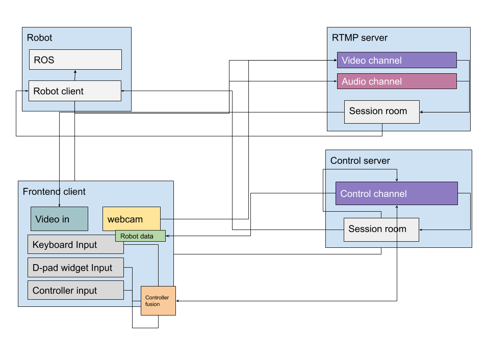

# Telepresent
A telepresence system for controlling robots remotely.

## Architechture

* robot client
* streaming server
* control server
* frontend client

### Technologies
* Docker
* [Netdata](https://github.com/netdata/netdata/tree/master/packaging/docker)

**Possibly**
* [SRS RTMP](https://github.com/ossrs/srs)
* [WebRTC ROS](https://github.com/RobotWebTools/webrtc_ros/tree/master/webrtc_ros)
* [Web_Video_Server](https://github.com/RobotWebTools/web_video_server)